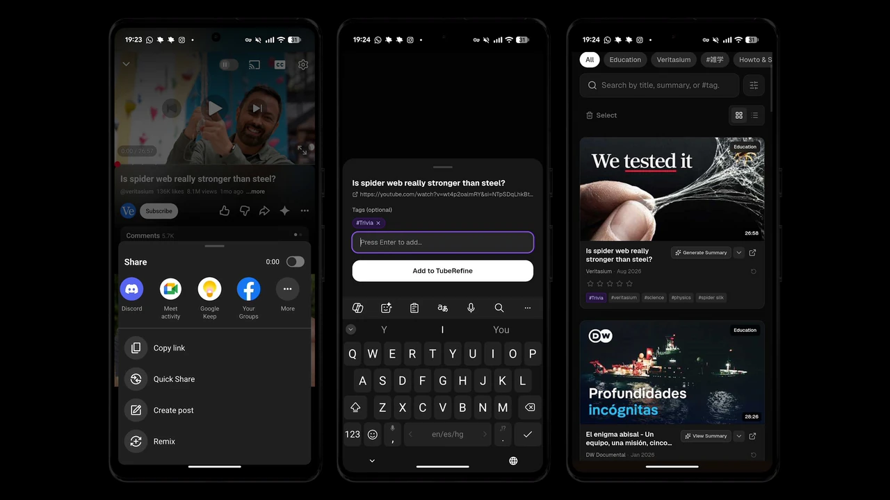
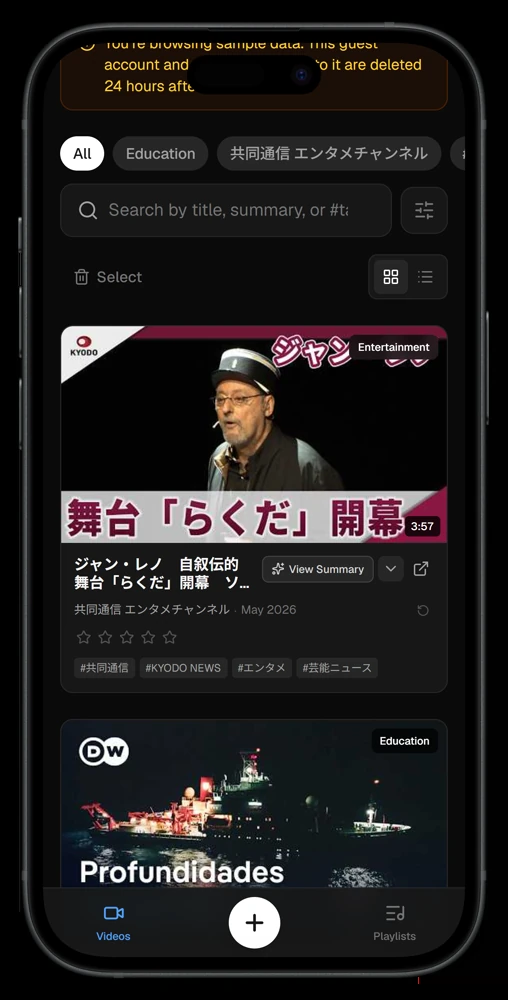
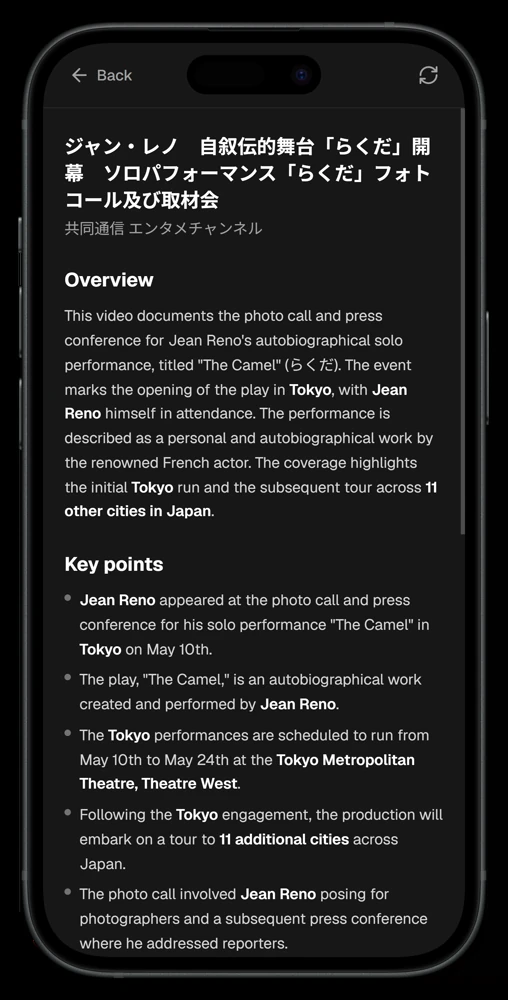
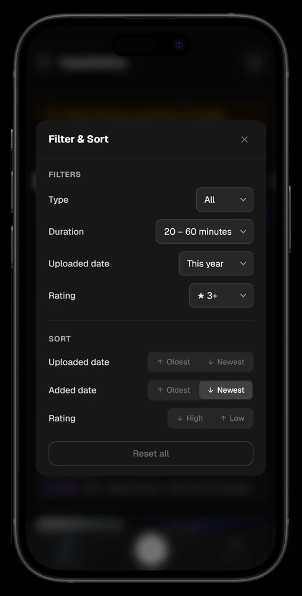

# TubeRefine

**AI-organized YouTube bookmarks — share a video from the YouTube app and it comes back tagged, summarized, and searchable across languages.**

TubeRefine is for everyone whose Watch Later list is where videos go to disappear. Save a video from the YouTube app's share menu (or paste a URL), and it is enriched the moment it lands: full metadata, proper-noun AI tags, and a ~300-character summary appear in the background. When you want to know what a video actually says — before watching, or months later without rewatching — one tap generates a detailed, chapter-aware summary from the video content itself. Everything is searchable, even across languages: tags are stored with English translations, so Japanese-tagged videos match English queries and vice versa.

**Live:** https://tube-refine.pekobit.com/

<p align="center">
  
</p>

<p align="center">
  
  
  
</p>

<p align="center"><sub>Saving straight from the YouTube share menu · the library, an on-demand video summary, and the filter sheet. Screens show the guest demo data.</sub></p>

## Features

- **Quick save** — share directly from the YouTube app via the PWA share target (`/save`), or paste a URL into the in-app add sheet; optional personal tags at save time
- **Automatic enrichment** — every bookmark is filled in the background:
  | Data | Source |
  |---|---|
  | Title & thumbnail | YouTube oEmbed, with Data API fallback for embed-disabled videos |
  | Channel, duration, upload date, category, description | YouTube Data API v3 |
  | 5–10 proper-noun AI tags + ~300-char summary | Supabase Edge Function (LLM) |
  | English copies of all tags | Google Cloud Translation |
- **Video summaries** — on-demand Markdown summaries generated by Gemini, which ingests the actual video from its URL (not just the description); chapters parsed from the description anchor timestamps that link straight back to the right moment; results are cached and can be regenerated
- **Cross-language search** — one search box covers titles, summaries, channels, categories, and all tag sets (original + English translations)
- **Organize** — 5-star ratings, quick-filter chips (category / channel / tag), duration & upload-date filters, three sort orders, grid/list views with a dedicated Shorts carousel
- **Trash bin** — soft delete with restore and permanent delete
- **PWA** — installable, mobile-first, registered as a native share target

## How it works

```
POST /api/bookmarks
  ├─ oEmbed ................ title, thumbnail (Data API fallback below)
  ├─ YouTube Data API ...... channel, duration, description, tags, category
  ├─ Translation API ....... English copies of tags (tags_en)
  ├─ INSERT bookmark ....... ai_status = 'pending'
  └─ after() ............... invoke Edge Function "ai-tagging" in background
                               ├─ LLM generates tags_ai + description_summary
                               ├─ Translation API → tags_ai_en
                               └─ ai_status → 'done' (or 'failed' → Retry in UI)
```

- All AI calls go through **OpenRouter** — Gemma 3 12B for background tagging, Gemini 2.5 Flash-Lite for video summaries. Video ingestion from a YouTube URL is a Gemini-specific capability, so the summary model is deliberately pinned.
- All database access is server-side: route handlers authenticate via Supabase SSR cookies and scope every query per user; Row Level Security backs this up at the database layer, and a session-refreshing proxy keeps tokens valid.
- The ai-tagging Edge Function only accepts service-role calls (JWT role claim, signature verified by the platform gateway) — its payload is trusted, so user-originated invocations are rejected.
- Analysis can never hang: bookmarks stuck in `pending` for 5+ minutes are swept to `failed` (retryable from the card), and the dashboard runs a single poller that stops as soon as nothing is pending.
- Video summaries are generated on demand (`POST /api/bookmarks/[id]/summarize`, `maxDuration = 60`) and cached in the `video_summary` column.

## Tech stack

| Layer | Technology |
|---|---|
| Frontend | Next.js 16 (App Router), React 19, TypeScript, Tailwind CSS v4 |
| AI | OpenRouter (Gemma 3 12B / Gemini 2.5 Flash-Lite) |
| Backend / DB | Supabase (Postgres, RLS, Edge Functions) |
| Auth | Google OAuth via Supabase Auth |
| External APIs | YouTube Data API v3, YouTube oEmbed, Google Cloud Translation |
| Infra | Vercel |

## Local development

```bash
git clone https://github.com/Peko-Peko-Bit/tube-refine-public.git
cd TubeRefine
npm install

# create .env.local — see required keys below
npm run dev   # http://localhost:3000
```

Required keys in `.env.local`:

| Key | Purpose |
|---|---|
| `NEXT_PUBLIC_SUPABASE_URL` / `NEXT_PUBLIC_SUPABASE_ANON_KEY` | Supabase project |
| `SUPABASE_SERVICE_ROLE_KEY` | server-side invocation of the ai-tagging Edge Function |
| `OPENROUTER_API_KEY` | video summaries (Gemini via OpenRouter) |
| `ALLOWED_EMAILS` | comma-separated allowlist for Google sign-in; unset rejects every Google sign-in (guest mode is unaffected) |

Optional: `YOUTUBE_API_KEY` (rich metadata — channel, duration, tags, category), `GOOGLE_TRANSLATE_API_KEY` (English tag copies for cross-language search).

Database schema and migrations live in [supabase/](supabase/). Deploy the tagging function with `supabase functions deploy ai-tagging`, then set its secrets: `supabase secrets set OPENROUTER_API_KEY=... GOOGLE_TRANSLATE_API_KEY=...`.

### Access and rate limits

Google sign-in is allowlisted via `ALLOWED_EMAILS`; everyone else uses the guest button, which signs in anonymously (enable **Allow anonymous sign-ins** in the Supabase dashboard).

The routes that spend money — saving a bookmark, generating a summary, retrying AI tagging, re-fetching metadata — are rate limited by [`src/lib/rate-limit.ts`](src/lib/rate-limit.ts), backed by the `check_rate_limit()` function in [supabase/migrations/](supabase/migrations/):

| | Window | save | summarize | retry | refetch |
|---|---|---|---|---|---|
| Guest, per account | 24h | 10 | 3 | 3 | 10 |
| **Guest, all accounts combined** | 24h | **100** | **50** | — | — |
| Signed in, per user | 1h | 60 | 30 | 30 | 60 |

The combined guest budget is the one that bounds spend: anonymous accounts are free and unlimited, so a per-account cap alone resets whenever someone clears their cookies. Signed-in users never consult it, so guests exhausting the demo budget cannot lock the owner out.

Guest accounts are deleted 24 hours after sign-in by `cleanup_guest_data()`, which pg_cron runs hourly. Deleting the account is the whole job — `bookmarks.user_id` cascades from `auth.users`, so the bookmarks go with it.

## Deployment

Deployed on **Vercel** — push to `main` triggers a production build. Supabase hosts the database, auth, and the ai-tagging Edge Function. Google OAuth is configured in the Supabase dashboard with `<your-domain>/auth/callback` as the redirect URL.

## About this repository

This is a public mirror of the private repository TubeRefine is developed in. It is updated by snapshot, so the history here is one commit per sync rather than the development history, and a small number of files are not included. Issues and pull requests are welcome, but changes are applied upstream and arrive here with the next sync.

Licensed under the [MIT License](LICENSE).
